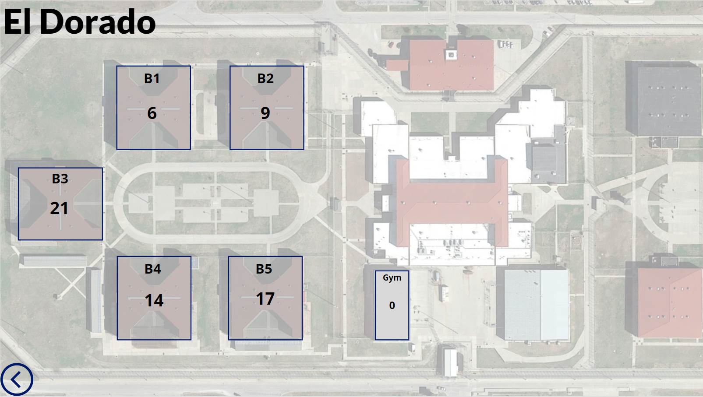
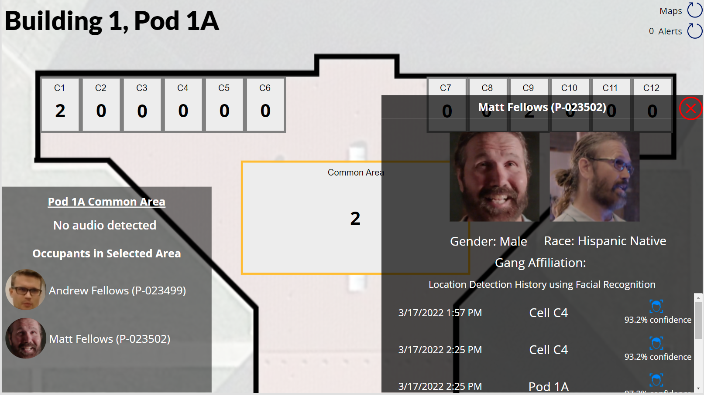
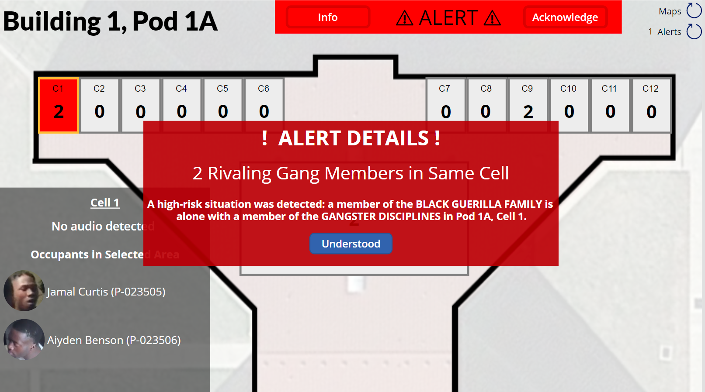
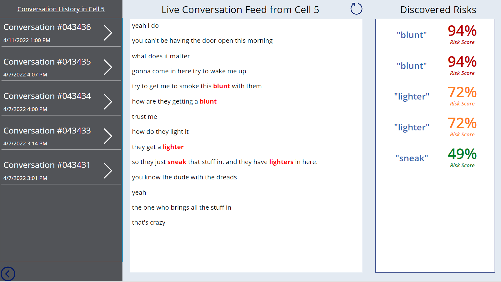

# Corrections Facility Intelligence
This solution leverages Microsoft Azure's cognitive service to provide a new level of "intelligence" to a correctional facility. A facilties *already existing* CCTV feed (video/periodic still imagery) will be fed into the system. The solution uses Azure's facial recognition capabilities to recognize offenders in each video feed and thus plot the movement of offenders in the facility. Guards will be alerted of potential high-risk encounter. For example, if it is detected a member of two rivalving gangs step into the same cell together along, an alert will be generated on live displays and sent to mobile phones that guards will have on their person.

Additionally, administrators will be able to "rewind" to any point in the past and see an interactive "map" of where each and every offender was at the time.

Finally, if microphones are installed in the facility, the live feed will also go through Azure's speech-to-text service. If a conversation is detected, this conversatin will be fed through an algorithm that looks for words or phrases that are deemed "high risk" and pose a threat to the security and safety of officers and other offenders. Guards will be alerted to discussions that are detected in each part of the facility and can read the live transcript of the conversation as it happens. Each high-risk word or phrase will be flagged and displayed to the guards/administrators.

## Solution Screenshots
An interactive dashboard of the correctional facility, showing number of offenders in each building, pod, gym, or other common area.

The **Facility Intelligence Dashboard** displays the location of each offender (in a cell, pod common area, gym, etc.) and a history of where they were last seen, and when:

A warning is displayed on the dashboard and pushed to guard's mobile devices when a potentially risky event occurs. For example here, two members of rivaling gang step into the same cell together, indicating a fight may occur:

A live audio feed is transcribed into plain text and can be monitored remotely. Words or phrases that may denote risk to the facility and it's residents and staff are flagged and guards are alerted.
