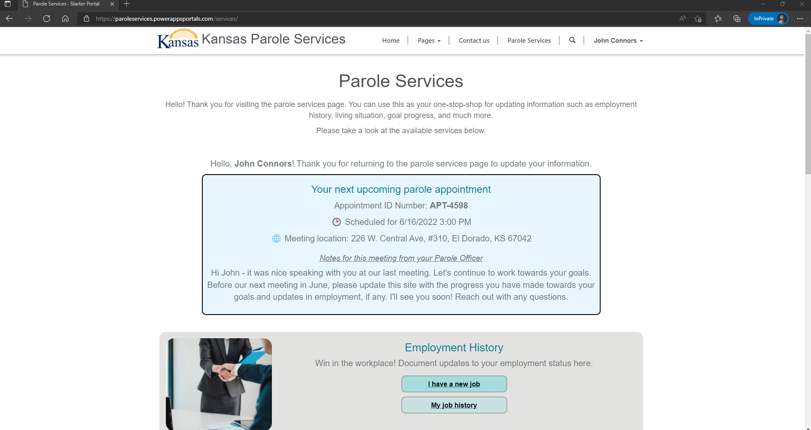
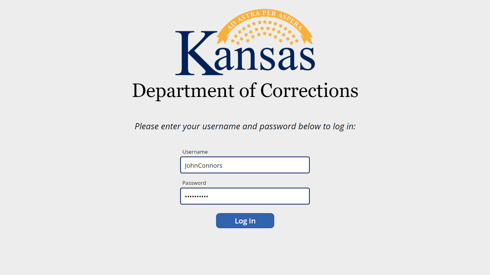
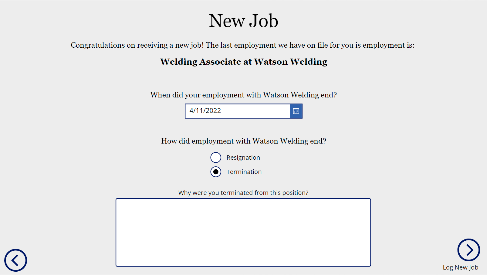

# Corrections: Parole Management
This solution is designed to serve as the medium between a State's probation/parole services and the constituents on parole. Parolees can log into a portal (website) on their personal devices - computer, tablet, mobile, etc. - and update the parole officer on life events as they happen: employment updates, address changes, new goals, major accomplishments, life events, and more. Upon arriving at a parole facility for their monthly parole appointment, they will also be given the opportunity to make these changes on a mobile app on a tablet in the waiting room. 

The changes that the parolee makes will populate into a parole officer-specific view on the "back-end". The officer can review these changes individually while AI assists in guiding the officers attention to the most "high risk" changes to their profile. In addition to the risk flags, the self-reported parolee information is used to assign the parolee an aggregate *risk score*. This risk score indicates the general level of risk this parolee has of failing parole. Aggregate data is also available in a dashboard, showing leadership the breakdown of:
1. Annualized salary distribution (how many parolees are compensated in each salary band)
2. Month-to-month average salary increases for the entire parolee population
3. Distribution of compensation format (how many are salaried vs. hourly)
4. Average employment tenure trends over time
5. The number of new jobs started by parolees each month

## Screenshots:
The online portal a parolee can check in to on their mobile device to provide life updates:

The check-in app on a tablet in the waiting room of the parole office: check in

The check-in app on a tablet in the waiting room of the parole office: home screen

Updating an employment update in the check-in app:

After a parolee checks in for their office visit (using the kiosk tablet), their parole officer will be notified on their mobile device:  

A Parole/Probation Officer's view into the parolee's record, displaying background information and flagging the important updates the parolee has provided since the last meeting:

Administrators and leadership will have a parole dashboard available, allowing them to keep a pulse on how effective their program has been for parolees:

## Solutions
All solutions can be found in [the solution folder](./solutions/).
|Solution|Notes|
|-|-|
|[1.0.0.1](./solutions/ParoleKiosk_1_0_0_1.zip)|First solution export. Core data structure only.|
|[1.0.0.2](./solutions/ParoleKiosk_1_0_0_2.zip)|Added core functionality. Excludes check in canvas app.|
|[1.0.0.3](./solutions/ParoleKiosk_1_0_0_3.zip)|Added Check In table and cloud flow to alert Parole Officer via push notification of check in at the office|
|[1.0.0.3 fixed](./solutions/ParoleKiosk_1_0_0_3_fixed.zip)|Version 1.0.0.3 above had import issues (missing dependencies). These are fixed. This version is importable.|
|[1.0.0.6](https://github.com/TimHanewich/Power-Platform-Assets/releases/download/2/ParoleKiosk_1_0_0_6.zip)|Power BI dashboard as custom page, MD-app theming, Parolee (contact) business process flow|

## Portal Content
The portal content can be found [here](./parole-kiosk-portal.xml). You can import this into an environment with the **Portal Records Mover** tool in the XrmToolbox. This will import all web content (includes pages, with the full HTML markup and so forth). If you have trouble with this important, the raw content is supplied [here](./web-content/) (you can copy and paste).

## Power BI Report
You can download the Power BI report (seen above) from [here](https://github.com/TimHanewich/Power-Platform-Assets/releases/download/1/parole-dashboard.pbix). This contains both the data and the report.

## Steps to deploy
1. In a new environment, create a portal. We need to create a portal first because this solution has portal-related dependencies. If those are not installed in the environment prior to import, import will fail.
2. Import the solution (download from above).
3. Using the **XrmToolbox Portal Records Mover**, import the portal content (found above).
4. Delete the original portal you had made. Create a new portal. Opt to create a portal from an existing record(s) and choose the portal record that was imported.
5. Deploy the Power BI Dashboard (found above) to Power BI online. Open the *Parole Management* Model-Driven app. In this app you'll find a custom page. Update the Power BI tile URL to the URL of the Power BI report you've deployed.
6. Create demo data: portal contact "John Connors" (use [portrait](./assets/portrait.jpg) and [profile](./assets/profile.jpg) pictures), etc.
7. Install Power Automate on your phone and log in. This will be used to notify you (acting as the parole officer in this case) upon the parolee checking in via the kiosk app.