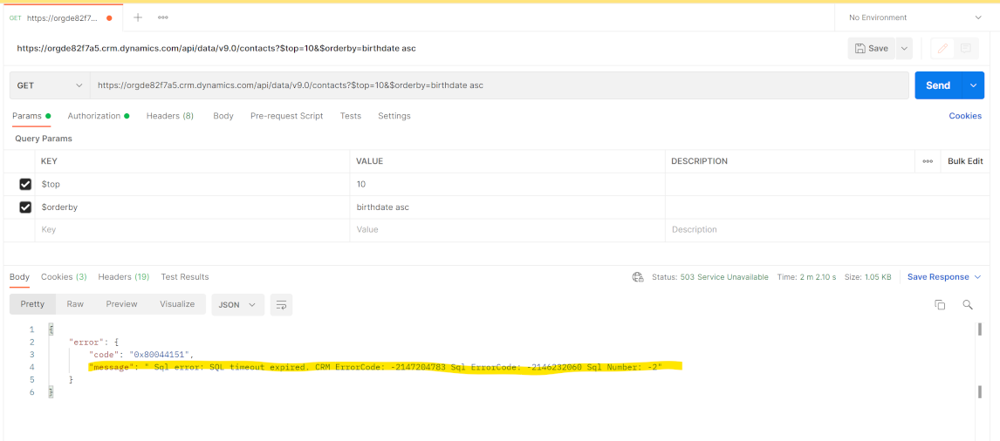

# Comparing the performance of Microsoft Dataverse

### Example Contact Record:
```
{
   "FirstName":"Rhoda",
   "LastName":"Stott",
   "BirthDate":"1953-07-25T00:00:00",
   "MobilePhone":7768294369,
   "AddressCity":"Waco",
   "AddressLatitude":31.634629,
   "AddressLongitude":-97.265100,
   "AnnualIncome":64000
}
```

## Playing Field


### Dataverse Configurations
Since Dataverse is a database as a service, no configurations or tunes *can* be made. We will rely on Dataverse to allocate and arrange resources to best serve the request.

### SQL Configurations & Hardware
The Dataverse performance was directly compared to a Microsoft SQL database hosted on Microsoft Azure.
The SQL database tested against was **Standard Tier** (S0). According to Microsoft, this is the "go-to option for getting started with cloud-designed business applications. It offers mid-level performance and business continuity features".
The **Standard Tier** allocates 10 **DTU's** to the SQL Database. You can read more about DTU as a measure of performance [here](https://docs.microsoft.com/en-us/azure/azure-sql/database/service-tiers-dtu?view=azuresql).

The SQL database that was tested against has not employed any "SQL tuning" techniques. Apart from the primary key, no indexes were made, no manual optimizations were made (to better suit the queries made below), no use of temp tables, etc.


## Test Results
- Count rows in table
- Get most recent 10 records
- Latitude within certain boundary
- Living in a certain city
- Last name begins with
- Large data download

|Test|SQL Query|Time|Dataverse Query|Time|
|-|-|-|-|-|
|Count rows in table|SELECT COUNT(Id) FROM CONTACT|6:40|https://org1ceaa16f.crm.dynamics.com//api/data/v9.1/RetrieveTotalRecordCount(EntityNames=['contact'])|0:0.4|
|Select oldest 10 people|SELECT TOP 10 * FROM CONTACT ORDER BY BirthDate ASC|0:28|https://org1ceaa16f.crm.dynamics.com/api/data/v9.0/contacts?$top=10&$orderby=birthdate asc|0:48|
|Latitude within certain boundary|SELECT * FROM CONTACT WHERE AddressLatitude > 0.2 AND AddressLatitude < 0.4|1:27|https://org1ceaa16f.crm.dynamics.com/api/data/v9.0/contacts?$filter=address1_latitude gt 0.2 and address1_latitude lt 0.4|11.51|
|Living in a certain city|SELECT TOP 50 * FROM CONTACT WHERE AddressCity = 'Los Angeles'|0:02|https://org1ceaa16f.crm.dynamics.com/api/data/v9.0/contacts?$filter=address1_city eq 'Los Angeles'|52:74|
|Last name begins with|SELECT * FROM CONTACT WHERE LastName LIKE 'at%'|0:10|https://org1ceaa16f.crm.dynamics.com/api/data/v9.0/contacts?$filter=startswith(lastname, 'at')|0:15|
|First name contains|SELECT * FROM CONTACT WHERE FirstName LIKE '%tim%'|0:09|https://org1ceaa16f.crm.dynamics.com/api/data/v9.0/contacts?$filter=contains(firstname, 'tim')|0:09|
|Large data download|SELECT TOP 10000 * FROM CONTACT|0:01|https://org1ceaa16f.crm.dynamics.com/api/data/v9.0/contacts?$top=10000|0:10|

## Other Learnings
- The 12-month demo tenants we receive are designated "trial" tenants. Compared to a production tenant, the trial tenant receives less resources and has limitations:
   - There is a limit on the total number of records you can place in the tenant. This is a limit on **the entire tenant**, not for a specific environment or specific table. Meaning, if you hit the limit across the tenant, you will not be able to upload a single record in *any* environment in *any* table.
      - Error message when attempting to upload a record via the web API: *Unable to create new record of type 'contacts'. Content: {"error":{"code":"0x80072325","message":"Storage quota exceeded. Your organization instance has reached the storage limit for a trial or demo instance. Please reach out to your administrator, to convert this instance into paid one or create a service request with Microsoft support team. SqlException: The database 'db_crmcorenam_20220505_03304536_f788' has reached its size quota. Partition or delete data, drop indexes, or consult the documentation for possible resolutions."}}*
   - The Dataverse DB in trial tenants/environments exhibits poor performance. When performing a query on the contacts table (sorting by a DateTime field) containing about 6,000,000 records, the query timed out:
      - 


## Notes
- Counting the number of records in the contacts table:
    - https://org1ceaa16f.crm.dynamics.com//api/data/v9.1/RetrieveTotalRecordCount(EntityNames=['contact'])
    - https://crmtipoftheday.com/1375/get-record-count-for-entities/