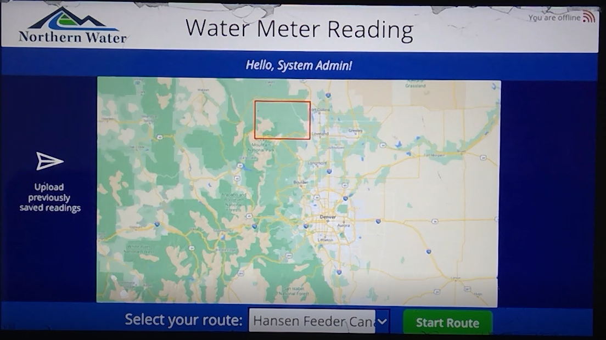
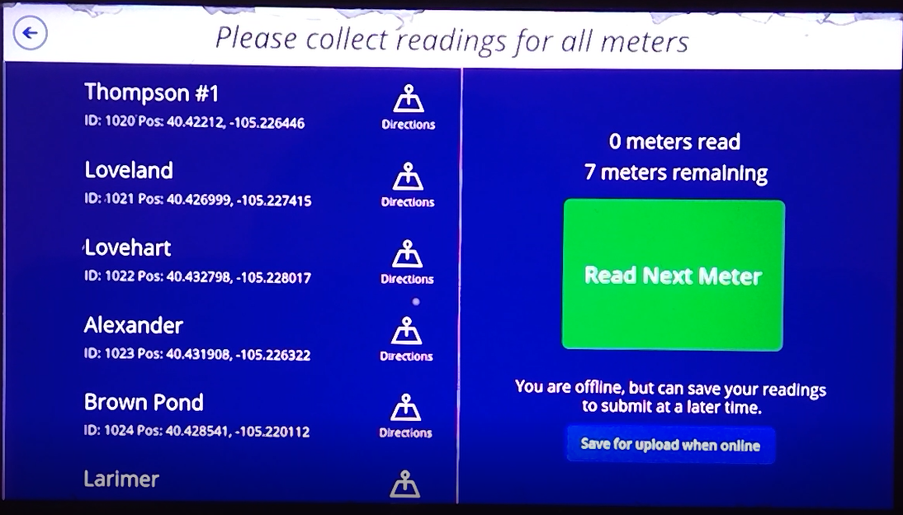
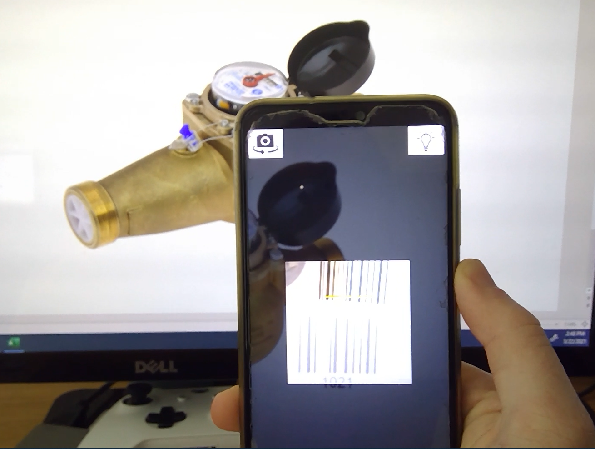
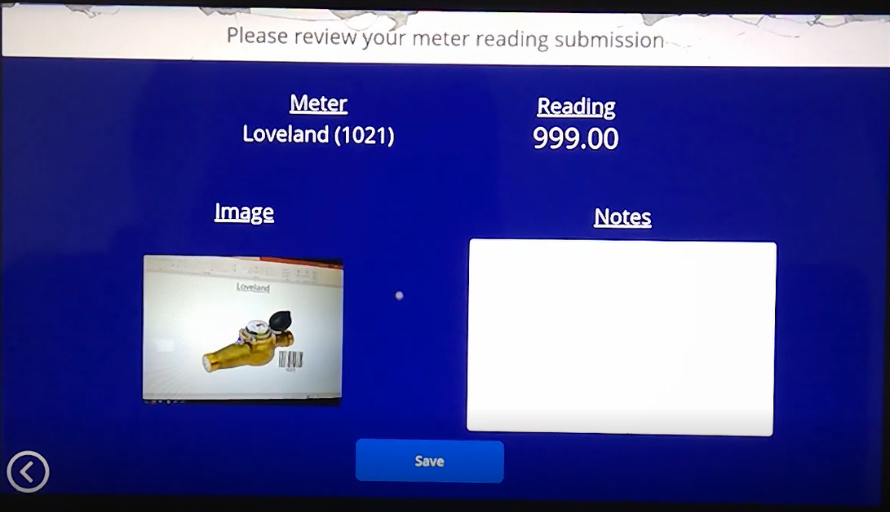
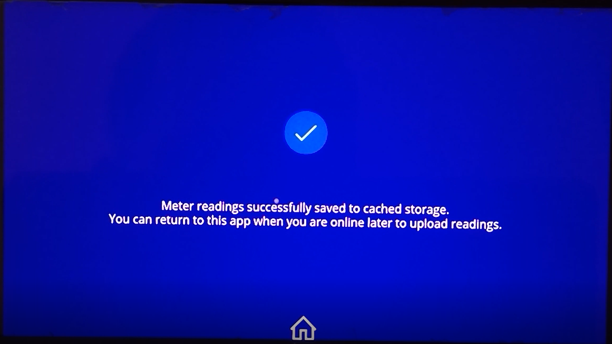
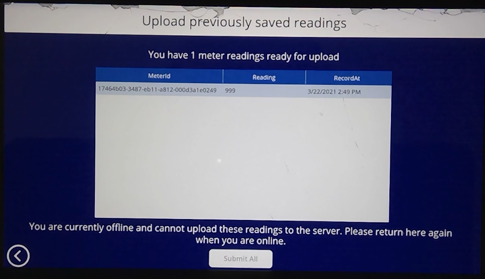

# Field Meter Inspections
Originally discussed with **Northern Water** in Colorado Springs, this solution showcases the Power Platform's abiliy to support a field-inspection use case in an offline setting. Northern Water sends out inspectors to water meters in the mountains of Colorado. The inspector's duty is to:
1. Scan the barcode on the side of the water meter
2. Enter in pertinent information about the water meter (current reading, has it rolled over)
3. Capture an image of the water meter
4. Add any necessary notes

Since the inspectors are in the mountains of Colorado, they will have no cellular signal, and thus will be in an **offline setting**. This has the capability of saving the inspection data to local storage and later uploading the records to Dataverse when the device regains connectivity.

## Visuals
Here is a recording of a demonstration of the *offline capabilities* of the mobile app (in airplane mode): https://youtu.be/qTjz97D-n38

The following are screenshots from the above video:

## Solutions
|Version|Notes|
|-|-|
|[1.0.0.2](./solutions/MeterReading_1_0_0_2.zip)|Full solution|