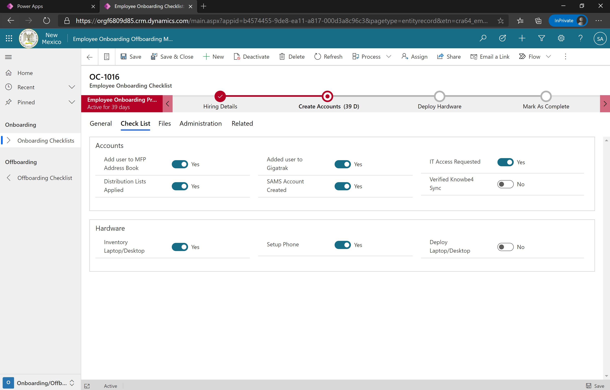

# HR Onboarding/Offboarding
New Mexico's Aging and Long-Term Services Department (ALTSD) was looking for a central location to digitally store documents, details, and steps/procedures for the onboarding and offboarding of their employees. This is a solution that virtually any organization or agency would be able to make use of.

## Solutions
|Version|Notes|
|-|-|
|[1.0.0.3](./solutions/HROnboardingOffboarding_1_0_0_3.zip)|Full solution|