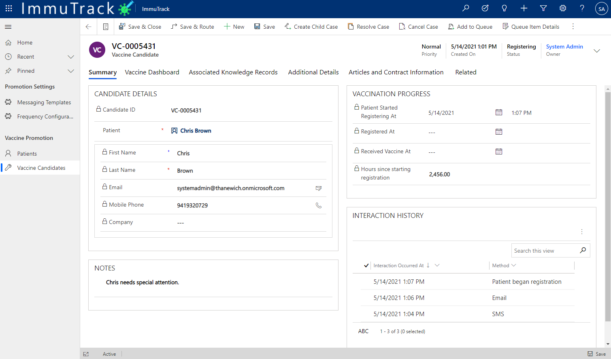
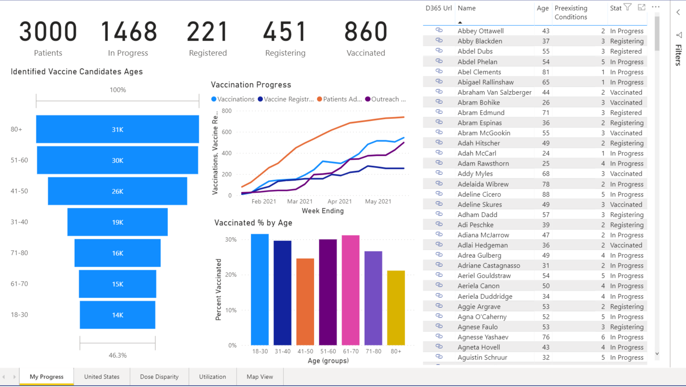

# ImmuTrack
Amid the push for improving COVID-19 vaccination rates in the United States in the middle portion of 2021, I collaborated with Microsoft's State & Local Government industry team and Health Information Exchange [CRISP](https://www.crisphealth.org/) to design and develop an early prototype of a immunization outreach platform.

This system is designed to manage the outreach/marketing campaigns to at-risk state citizens through multiple mediums at scale. The system enables administrators to evaluate which state residents are at highest risk, establish recurring outreach schedules for these residents, and monitor communication, registration, and vaccination status for these residents.

## Solutions
|Version|Notes|
|-|-|
|[1.0.0.3](./solutions/ImmuTrack_1_0_0_3.zip)|Full ImmuTrack Solution|