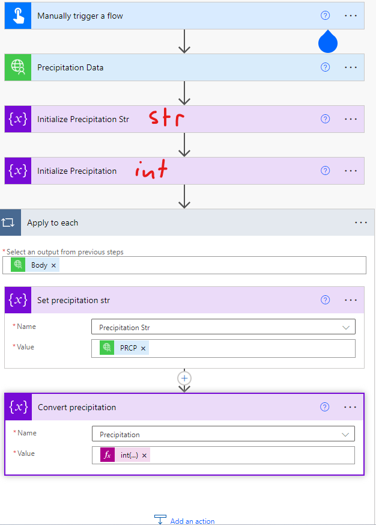
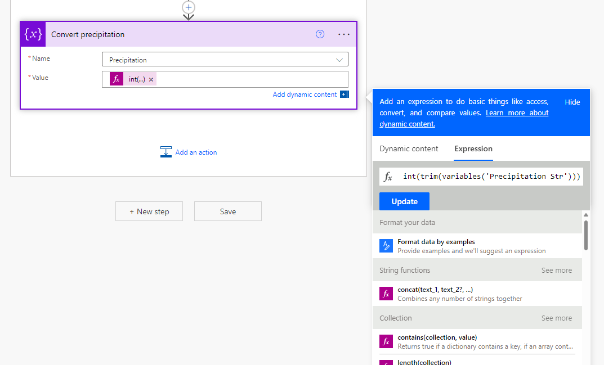

# National Centers for Environmental Information (NCEI) Precipitation Data Integration with Power Platform
This collection demonstrates how you can call the NCEI API to access precipitation data via Power Platform using a custom connector.

## Resources & Documentation
- API Documentation: [https://www.ncei.noaa.gov/support/access-data-service-api-user-documentation](https://www.ncei.noaa.gov/support/access-data-service-api-user-documentation)
- List of stations: [https://www.ncei.noaa.gov/access/homr/](https://www.ncei.noaa.gov/access/homr/)

### Example Request
https://www.ncei.noaa.gov/access/services/data/v1?dataset=daily-summaries&startDate=2022-01-01&endDate=2022-02-01&format=json&stations=US1FLMA0041

### Example Response
```
[
    {
        "DATE": "2022-01-01",
        "STATION": "US1FLMA0041",
        "SNOW": "    0",
        "PRCP": "    0"
    },
    {
        "DATE": "2022-01-02",
        "STATION": "US1FLMA0041",
        "SNOW": "    0",
        "PRCP": "    0"
    },
    {
        "DATE": "2022-01-03",
        "STATION": "US1FLMA0041",
        "PRCP": "   20"
    },
    {
        "DATE": "2022-01-04",
        "STATION": "US1FLMA0041",
        "SNOW": "    0",
        "PRCP": "    0"
    },
    {
        "DATE": "2022-01-05",
        "STATION": "US1FLMA0041",
        "SNOW": "    0",
        "PRCP": "    0"
    },
    {
        "DATE": "2022-01-06",
        "STATION": "US1FLMA0041",
        "SNOW": "    0",
        "PRCP": "    0"
    },
    {
        "DATE": "2022-01-07",
        "STATION": "US1FLMA0041",
        "PRCP": "    0"
    },
    {
        "DATE": "2022-01-08",
        "STATION": "US1FLMA0041",
        "SNOW": "    0",
        "PRCP": "    0"
    },
    {
        "DATE": "2022-01-09",
        "STATION": "US1FLMA0041",
        "SNOW": "    0",
        "PRCP": "    0"
    },
    {
        "DATE": "2022-01-10",
        "STATION": "US1FLMA0041",
        "SNOW": "    0",
        "PRCP": "    0"
    },
    {
        "DATE": "2022-01-11",
        "STATION": "US1FLMA0041",
        "SNOW": "    0",
        "PRCP": "    0"
    },
    {
        "DATE": "2022-01-12",
        "STATION": "US1FLMA0041",
        "SNOW": "    0",
        "PRCP": "    0"
    },
    {
        "DATE": "2022-01-13",
        "STATION": "US1FLMA0041",
        "PRCP": "    3"
    },
    {
        "DATE": "2022-01-14",
        "STATION": "US1FLMA0041",
        "SNOW": "    0",
        "PRCP": "    0"
    },
    {
        "DATE": "2022-01-15",
        "STATION": "US1FLMA0041",
        "SNOW": "    0",
        "PRCP": "    0"
    },
    {
        "DATE": "2022-01-16",
        "STATION": "US1FLMA0041",
        "SNOW": "    0",
        "PRCP": "    0"
    },
    {
        "DATE": "2022-01-17",
        "STATION": "US1FLMA0041",
        "PRCP": "   41"
    },
    {
        "DATE": "2022-01-18",
        "STATION": "US1FLMA0041",
        "SNOW": "    0",
        "PRCP": "    0"
    },
    {
        "DATE": "2022-01-19",
        "STATION": "US1FLMA0041",
        "SNOW": "    0",
        "PRCP": "    0"
    },
    {
        "DATE": "2022-01-20",
        "STATION": "US1FLMA0041",
        "SNOW": "    0",
        "PRCP": "    0"
    },
    {
        "DATE": "2022-01-21",
        "STATION": "US1FLMA0041",
        "SNOW": "    0",
        "PRCP": "    0"
    },
    {
        "DATE": "2022-01-22",
        "STATION": "US1FLMA0041",
        "PRCP": "    0"
    },
    {
        "DATE": "2022-01-23",
        "STATION": "US1FLMA0041",
        "PRCP": "   13"
    },
    {
        "DATE": "2022-01-24",
        "STATION": "US1FLMA0041",
        "SNOW": "    0",
        "PRCP": "    0"
    },
    {
        "DATE": "2022-01-25",
        "STATION": "US1FLMA0041",
        "SNOW": "    0",
        "PRCP": "    0"
    },
    {
        "DATE": "2022-01-26",
        "STATION": "US1FLMA0041",
        "PRCP": "   99"
    },
    {
        "DATE": "2022-01-27",
        "STATION": "US1FLMA0041",
        "PRCP": "    8"
    },
    {
        "DATE": "2022-01-28",
        "STATION": "US1FLMA0041",
        "SNOW": "    0",
        "PRCP": "    0"
    },
    {
        "DATE": "2022-01-29",
        "STATION": "US1FLMA0041",
        "SNOW": "    0",
        "PRCP": "    0"
    },
    {
        "DATE": "2022-01-30",
        "STATION": "US1FLMA0041",
        "SNOW": "    0",
        "PRCP": "    0"
    },
    {
        "DATE": "2022-01-31",
        "STATION": "US1FLMA0041",
        "SNOW": "    0",
        "PRCP": "    0"
    },
    {
        "DATE": "2022-02-01",
        "STATION": "US1FLMA0041",
        "SNOW": "    0",
        "PRCP": "    0"
    }
]
```

### Stations that work
- US1FLSS0047
- US1FLMA0041

## Creating the Flow that polls the API and converts
There is an issue with the API. As seen in the example response above, the API returns the Precipitation (`PRCP`) and Snow (`SNOW`) data as an integer with a leading series of spaces. The custom connector cannot directly convert this to an integer, so the property type has to be a `string` with us handling the conversion via Power Automate. Here is how to do that conversion in Power Automate:
- 
- 

## Solutions
You can import the finished custom connector by downloading and importing [this solution](./solutions/NCEI_1_0_0_1.zip). Or, you can find the [Swagger Definition (JSON) here](./solutions/NCEI-Precipitation.swagger.json) and import this as a custom connector through the "New custom connector --> Import an OpenAPI file" function.