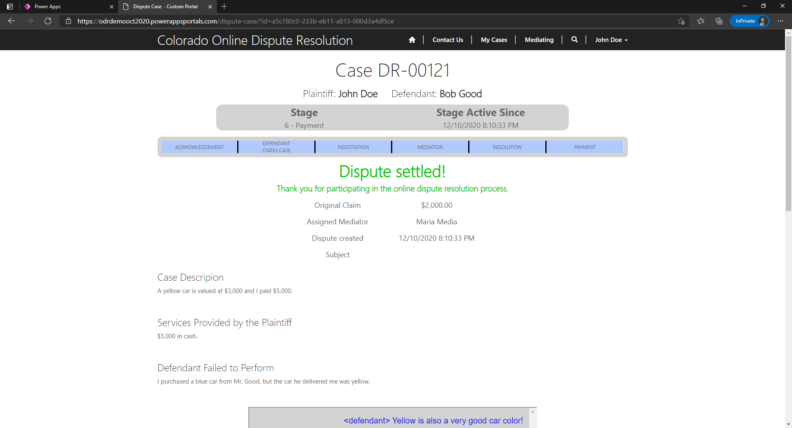

# Judicial: Online Dispute Resolution
Colorado's Judicial Branch was looking for a way to provide two parties the opportunity to settle a dispute before the case heads to the state court system. The department approached me and team with this vision and an ask for assistance in indentifying a suitable solution.

I built a fully functioning early iteration of such a system on Microsoft's Power Platform using Power Apps, Power Automate, Power Portals, and core HTML/CSS/JS.

The system provides the following functionality:
- New dispute filing for the general public (custom data gathering for different types of disputes)
- Account registration and dispute-lead invitation
- Automated dispute stage progression
- Asyncrhonous chat functionality between the plaintiff and defendant
- Dispute moderation by an assigned Judicial staff member
- Settlement offer proposal, acceptance, and counter offering support

