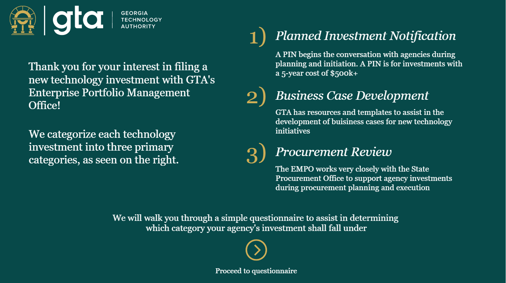
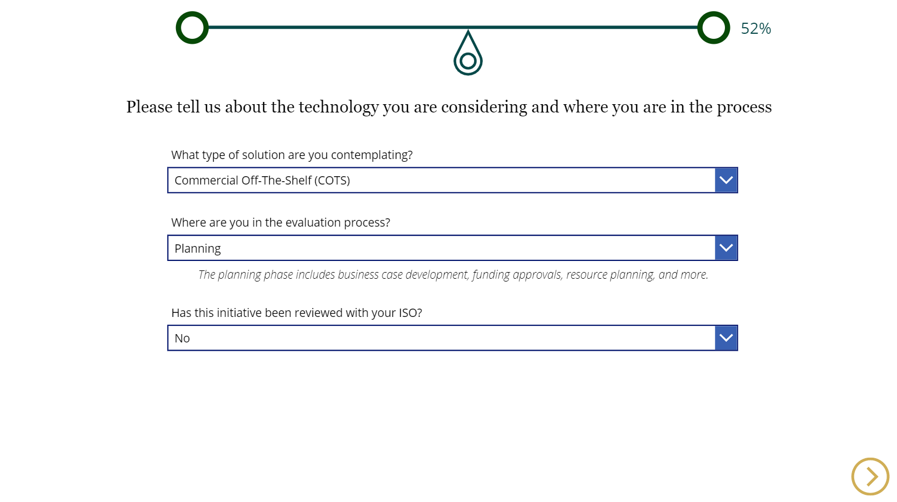

# Technology Investment Management

Georgia Technology Authority's Enterprise Portfolio Management Office (EPMO) assists state agencies with the planning and procurement of large technology investments. State agencies submit applications to have an investment reviewed and this is routed through a set of procedures based upon several criteria.

EPMO approached my team and described their need to streamline the investment routing process. I worked with administration to acutely understand their needs and the business process and logic behind this workflow. I carefully designed and developed a solution for EPMO that addressed everything they were looking to improve upon and more.

Several project features:

Dynamic investment questionnaire
Embedded ingestion web app in the GTA EPMO website
Internal task routing based on investment type and scale
Automated EPMO to agency communication
Procurement review generation and viewing with granular telemetry

## Screenshots

## Solution Packages
|Name|Note|
|-|-|
|[Version 1.0.0.6](./solutions/GAGTAEPMOManagedInvestment_1_0_0_6.zip)|Full solution (fully functioning)|

## Entity Relationship Diagram
A very basic ERD can be found [here](./erd.drawio) (can be opened on draw.io).