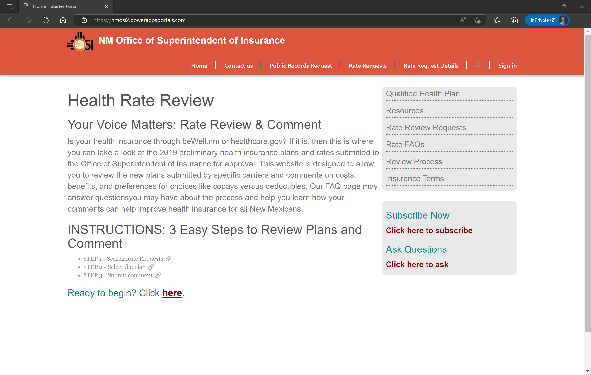
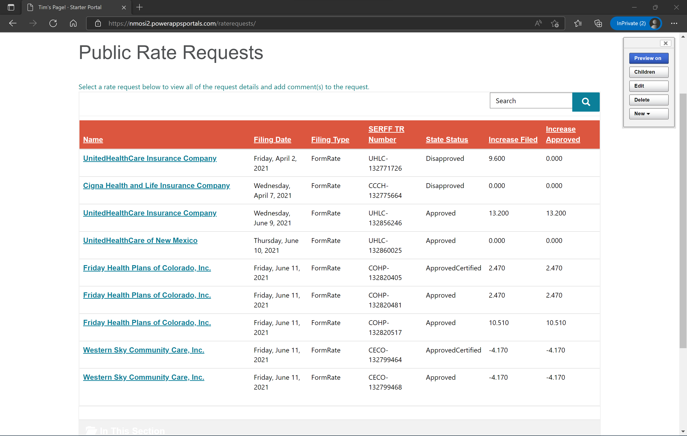
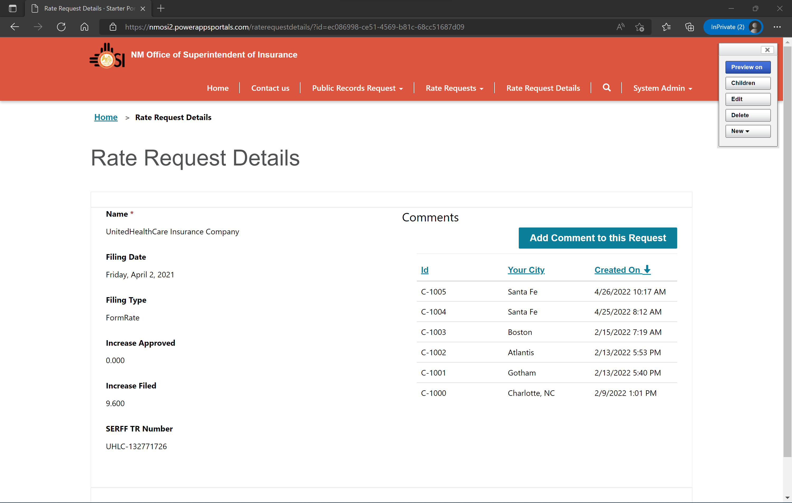
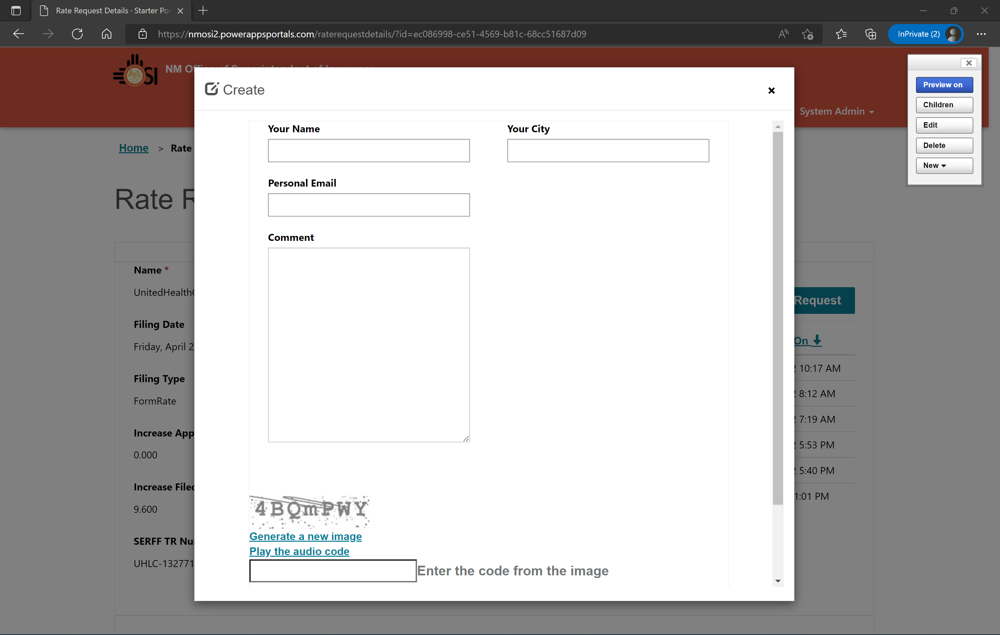

# Virtual Tables Demo
A virtual table is a custom table in Microsoft Dataverse that has columns containing data from an external data source. Virtual tables appear in your app to users as regular table rows, but contain data that is sourced from an external database, such as an Azure SQL Database. Rows based on virtual tables are available in all clients including custom clients developed using the Dataverse web services.

Read more about virtual tables [here](https://docs.microsoft.com/en-us/power-apps/maker/data-platform/create-edit-virtual-entities).

This "proof of concepts" demonstrates using Dataverse virtual tables in a Power Apps portal. We are dynamically pulling data from a 3rd party API at run time (when the portal page is visited) on demand.

This demo was built by **Tim Hanewich** (timh@microsoft.com) and **Al Smith** (alsmit@microsoft.com).

A custom API was developed (an Azure Function) to serve as the external data API in this demo example. The source code to this Azure Function can be found [here](./RestApiAzureFunction/).
- "Directory" endpoint, displaying all available tables: https://nmosi2.azurewebsites.net/nmosi
- RateRequests table content: https://nmosi2.azurewebsites.net/nmosi/RateRequests
- Associated metadata for the RateRequests table: https://nmosi2.azurewebsites.net/nmosi/$metadata

Associated code that handles the parsing of web requests, OData querying, sorting, etc. can be found in the CoreCode folder [here](./CoreCode/).

## Screenshots of Demo
The portal home page:

Displaying the data from the 3rd party API in the portal in a list view:

Pulling up details for a single specific record from the 3rd party API:

Logging a comment (in Dataverse) that ties to a specific record that exists within the 3rd party API:

## Resources
There are no guarentees these resources will exist/work in the future.
- NMOSI Endpoint (follows OData V4):
    - Directory (to provide to OData V4 Provider in D365 Virtual Tables:)
        - https://nmosi2.azurewebsites.net/nmosi
    - RateRequests table content:
        - https://nmosi2.azurewebsites.net/nmosi/RateRequests
    - Metadata
        - https://nmosi2.azurewebsites.net/nmosi/$metadata
- "sample" endpoint - a reconstruction of a functional OData V4 API
    - Directory
        - https://nmosi2.azurewebsites.net/sample
    - Advertisements table content:
        - https://nmosi2.azurewebsites.net/sample/Advertisements
    - Metadata
        - https://nmosi2.azurewebsites.net/sample/$metadata

## Tutorials used for learning
- https://dynamicsninja.blog/2018/09/30/virtual-entities-part-1-odata-v4/
- https://docs.microsoft.com/en-us/powerapps/maker/data-platform/virtual-entity-walkthrough-using-odata-provider#create-the-virtual-table

## Learnings from replication
- The metadata link for each table must be unique. It can not be the same metadatalink that is provided in the directory.