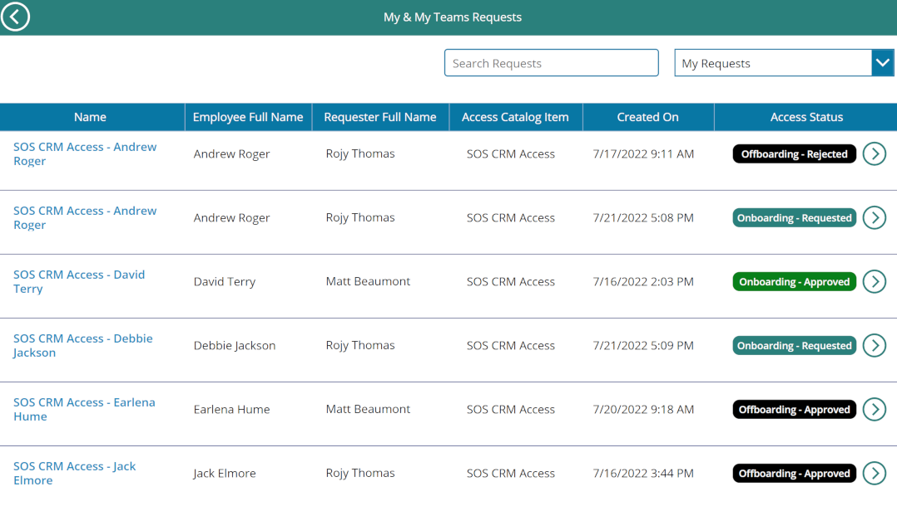
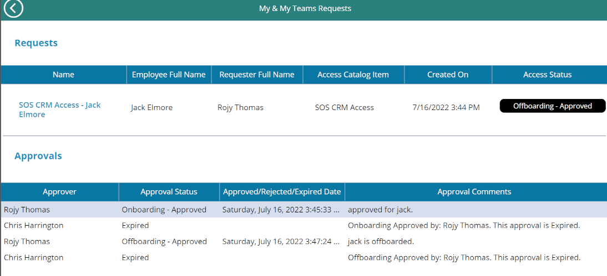

# Employee Onboarding/Offboarding
Originally developed for the State of Michigan, this is a prototype for an HR Onboarding and Offboarding approval workflow.
The solution contains the following functionality:

- A canvas App (for managers) and one model driven app (for admins)
- Dataverse tables to store Approvals, Approval History, Access Catalog, Access Catalog Admins , Department centric approvals.
- Request to onboard / offboard employees who falls within a manager's reporting hierarchy.
- Power automate for approval history, onboarding & offboarding.
- Security roles for both managers and admins.
- Works with manager hierarchy if enabled within the environment.

## Screen Shots
Viewing list of team requests

Viewing approvals for a single request

# Solution Files
|Version|Description|
|-|-|
|[1.0.0.3](./solutions/DTMBEmployeeOnboardingOffboarding_1_0_0_3.zip)|First release|

*Developed by Rojy Thomas*