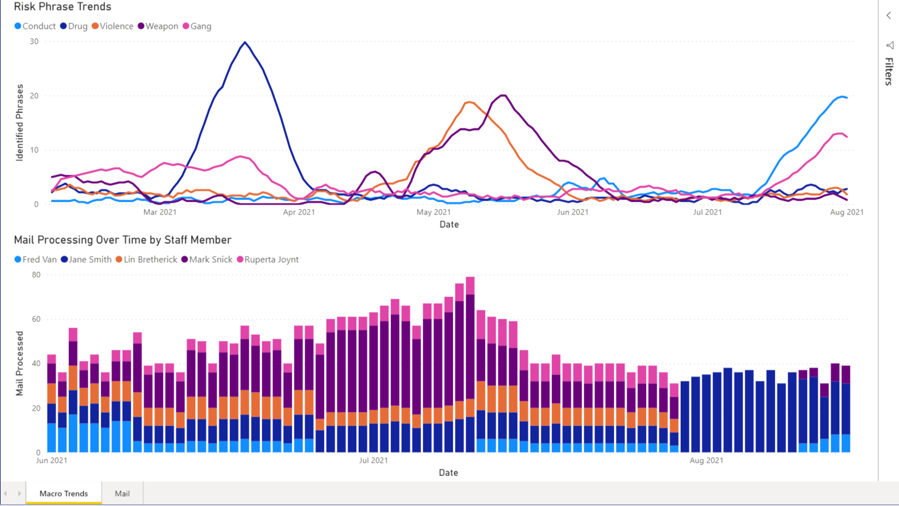
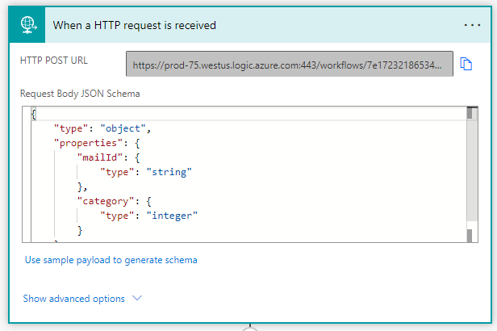
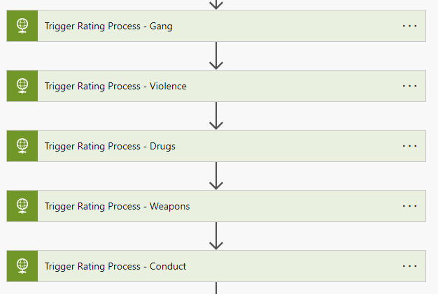
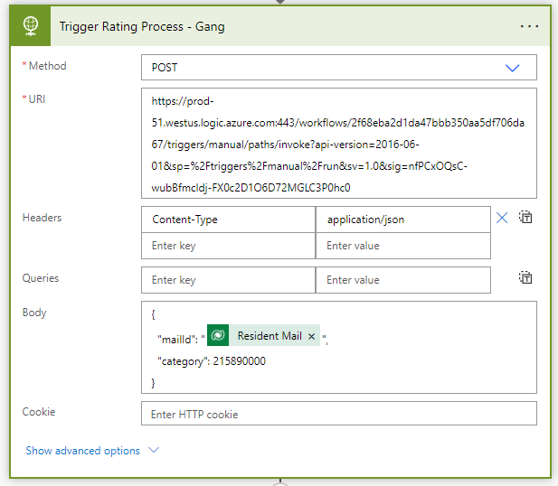
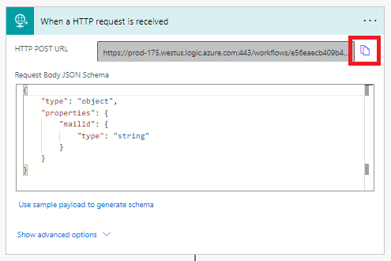
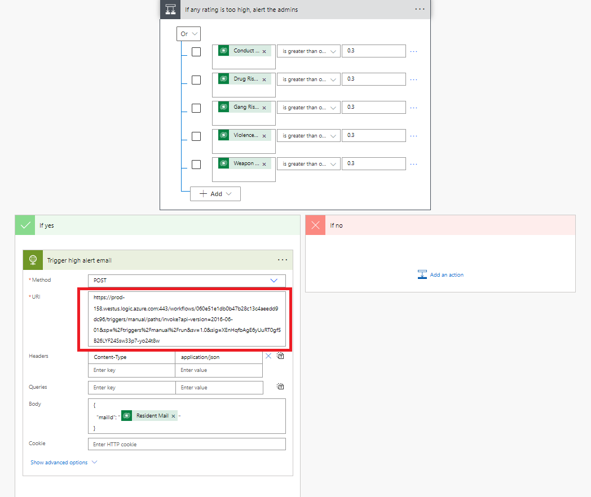
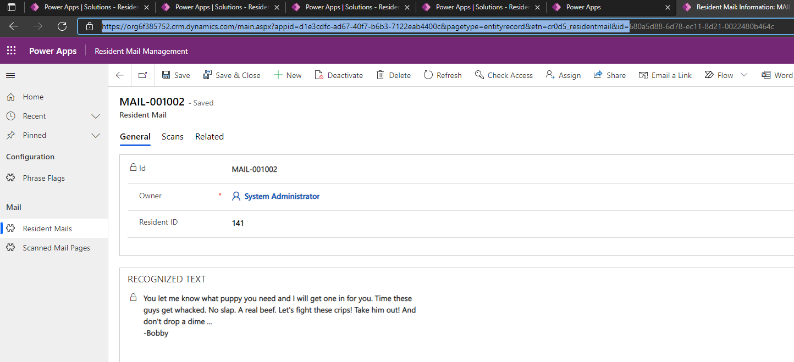
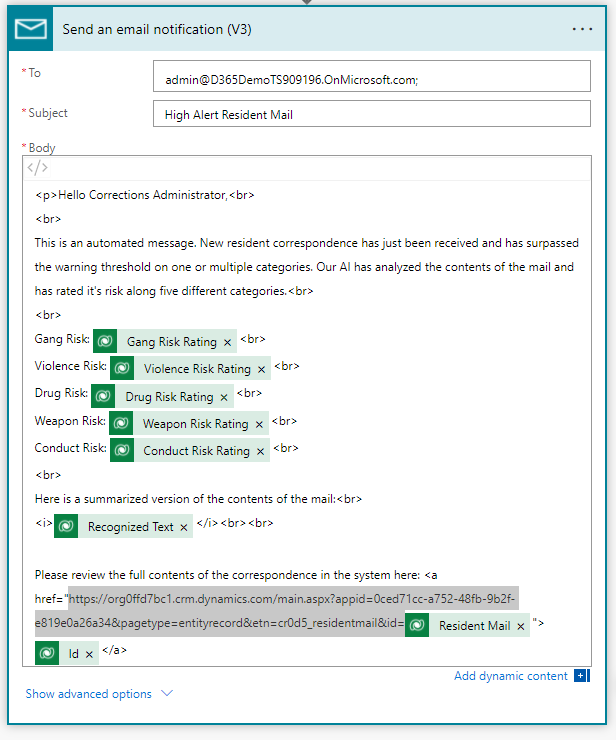
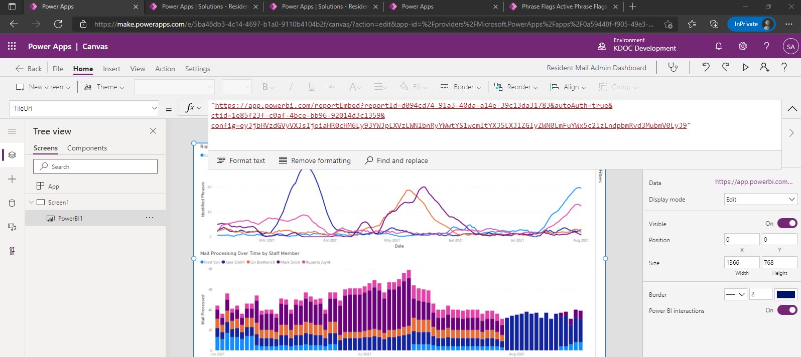

# Offender Mail Processing and Badge Generation POC
This is a proof-of-concept Power Platform solution that handles inmate mail processing and inmate badge generation:

## Mail Processing
A staff member with the Department of Corrections will "scan" incoming inmate mail by taking a picture of each mail page with the **Resident Mail Scanning** canvas app. The mail will be associated with the inmate via the inmate's ID number. Each page the inmate received will go through an analysis process that is driven by a Power Automate flow. The Power Automate workflow will search for key phrases and words (customizable) that indicate risk across five categories: Gang activity, Violence, Drugs, Weapons, or Conduct. Each letter will be rated according to the risk factor in each of these five categories. If one of these categories surpasses a predetermined risk threshold, administrators at the facility will be alerted via email. The administrators can review the letter in the **Resident Mail Management** model-driven application.

## Badge Generation
Staff members can generate an inmates badge via the **Resident Badge Generation** canvas app. This app will generate a unique QR code that will be placed on the badge and uniquely identifies that inmate. Officers within the facility can later scan this badge, review and document employee behavior or infractions, and review basic information about the inmate, via the **Officer Badge Verifier** canvas mobile app (phone form factor).

## Solutions
| Version | Notes |
|---------|-------|
|[1.0.0.2](./solutions/ResidentMailProcessing_1_0_0_2.zip)  | Initial release |
|[1.0.0.3](./solutions/ResidentMailProcessing_1_0_0_3.zip)| Tweaked foreign language detection |

## Deployment Instructions
1. Import the solution ZIP file that can be found above.
2. The workflow that assesses risk levels for each letter identifies risk by searching for **Phrase Flags** within each letter. Therefore, the user should create multiple **Phrase Flag** records with phrases and key words that they deem risky. To save time, I am supplying 44 sample phrase flags that **you can import**. You can find the sample data [here](./sample-data/cr0d5_phraseflags.csv).
3. [Enable and Reroute The Risk Assessment Flows](#enable-and-reroute-the-risk-assessment-flows)
4. [Enable and Reroute the Administrator Alert Flow](#enable-and-reroute-the-administrator-alert-flow)
5. This solution also contains a canvas app titled *Resident Mail Admin Dashboard*. This app's purpose is only to provide access to a simple Power BI dashboard the illustrates the "art of the possible" for analytics. 

If you wish to replicate this dashboard you will need to follow the instructions [here](#power-bi-dashboard-deployment).

## Enable and Reroute the Risk Assessment Flows
This solution relies on two Power Automate flows to perform the risk assessment analysis. Both flows must be turned on and must be updated to perform as expected.  

1. Open up the *Mail Category Risk Assessment* Power Automate flow. The trigger will be *When a HTTP request is received*. After opening this trigger, you should see the *HTTP POST URL*. Copy this value.

2. Open up the *Resident Mail Analysis* flow. In the middle of the flow, you will find a series of HTTP request actions.
.
3. In each of these HTTP request actions, replace the URI property with the *HTTP POST URL* you copied from the trigger of the *Mail Category Risk Assessment* flow in step 1.
.
4. After replacing **all** of the HTTP request actions seen the in the screenshot in step 2, save your *Resident Mail Analysis*.
5. Ensure both the *Resident Mail Analysis* and *Mail Category Risk Assessment* flows are **turned on**.

## Enable and Reroute the Administrator Alert Flow
If any of the inmate letters surprass a specified risk rating, administrators of the prison will be alerted via email. The Power Automate flow that performs this alert is trigger by an HTTP request. And flow that performs this trigger is the *Resident Mail Analysis* flow.

1. Open the *Alert administrator of high rating* flow. The trigger is titled *When a HTTP request is received*. Open this trigger and copy the *HTTP POST URL*.

2. At the bottom of the *Resident Mail Analysis* flow, open the condition action *If any rating is too high, alert the admins*. In the yes branch (true branch), open the *Trigger high alert email* action. Replace the **URI** property with the URL you copied in step 1:

3. Save the *Resident Mail Analysis* flow. And **be sure the *Alert administrator of high rating* flow is turned on**!
4. Be sure to replace the **to** line of the *Send an email notification (V3)* action in the *Alert administrator of high rating* flow. Replace this with the email address which you would like the alert to be delivered to.
5. The body of the alert email contains a hyperlink to the subject record in the Model-Driven app *Resident Mail Management* where the administrator can review the full content of the letter. You must replace a portion of the hyperlink with the Model-Driven app URL.
    1. Open the Model-Driven app *Resident Mail Management*. Open a Resident Mail record. Copy this portion of the URL:
    
    2. Replace this portion of the URL in the *Send an email notification (V3)* action in the *Alert administrator of high rating* flow with the URL you copied in step 1 above.
    

## Power BI Dashboard Deployment
1. Open the [.pbix Power BI Dashboard file](./dashboard/dashboard.pbix) and publish this to Power BI Online.
    1. If the references to data are broken, redirect the references to the data available in [this folder](./dashboard/data/).
2. Open the *Resident Mail Admin Dashboard* canvas app in edit mode. Update the Power BI tile's reference to the Power BI online dashboard by updating the *TileUrl* property to the URL of your new online dashboard.
